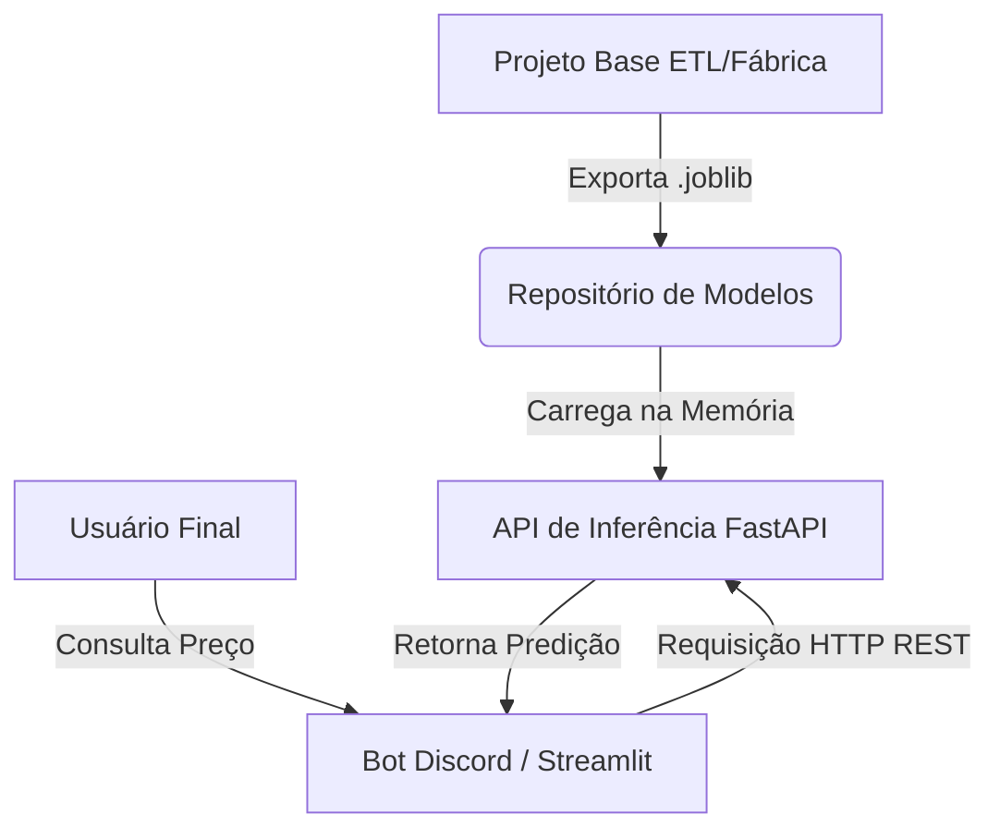

# Especificação do Projeto: Extensão Frontend/Bot (Previsor Steam)

## 1. Visão Geral
O projeto **Previsor Steam (Fábrica/ETL)** atua passivamente gerando binários treinados de Machine Learning (`.joblib`). O objetivo deste novo projeto de extensão é **consumir esses artefatos para realizar previsões em tempo real** e entregar valor ao usuário final.

Esta extensão funcionará de forma **isolada e desacoplada** da fábrica de dados, carregando os modelos otimizados na memória e expondo os resultados através de uma interface interativa (API + Bot/Dashboard).

## 2. Arquitetura do Sistema

A arquitetura recomendada é baseada em **Microserviços**:

1. **Camada de Inferência (Backend/API)**: 
   - Uma aplicação leve projetada exclusivamente para receber os inputs do usuário, carregar o arquivo `.joblib` na inicialização, e retornar a predição.
2. **Camada de Apresentação (Frontend/Bot)**: 
   - A interface do usuário. Pode ser um Bot do Discord/Telegram ou um Dashboard interativo (Streamlit).
3. **Repositório de Modelos**:
   - Uma estratégia para sincronizar os modelos gerados pelo projeto principal (via nuvem como AWS S3, ou via volumes do Docker caso rodem no mesmo servidor).

## 3. Stack Tecnológica Recomendada

* **Linguagem**: Python 3.10+ (Mesma versão do projeto base para evitar incompatibilidade no `joblib`).
* **Backend Framework**: `FastAPI` + `Uvicorn` (Alta performance e documentação Swagger gerada automaticamente).
* **Dependências de ML**: `scikit-learn`, `xgboost`, `lightgbm`, `pandas`, `joblib` (Mesmas versões exatas utilizadas no treinamento para evitar erros de desserialização).
* **Interface (Opções)**:
  * *Opção A (Dashboard)*: `Streamlit` (Mais rápido de criar e visualmente rico para dados estatísticos).
  * *Opção B (ChatBot)*: `aiogram` (Telegram) ou `discord.py` (Discord).
* **Containerização**: `Docker` e `Docker Compose` (Para garantir que o ambiente de inferência seja imutável).

## 4. Estrutura da API (Endpoints)

O microserviço de backend deve expor as seguintes rotas:

* `GET /health`
  * Verifica se a API está online e se os modelos `.joblib` foram carregados corretamente.
* `POST /predict/classificacao`
  * **Objetivo**: Prevê a direção do preço ("sobe", "cai", "mantém") em um horizonte (ex: 30 dias).
  * **Payload esperado**: JSON contendo as features numéricas/categóricas do jogo (ex: preço atual, descontos anteriores, dias desde a última sale, sazonalidade).
  * **Resposta**: Classe predita e as probabilidades para cada classe.
* `POST /predict/regressao`
  * **Objetivo**: Prevê o tempo contínuo ("Faltam X dias para a próxima promoção").
  * **Payload esperado**: JSON com as features.
  * **Resposta**: Número inteiro (dias).

## 5. Fluxo de Dados (Input / Output)

**Atenção Crítica**: O modelo carregado via `joblib` espera receber um DataFrame (ou array NumPy) com as **exatas mesmas colunas, na exata mesma ordem** em que foi treinado.

1. O Bot/App recebe o nome do jogo ou seu AppID.
2. O Bot consulta os dados "ao vivo" do jogo via API (Steam / ITAD).
3. O Bot processa/normaliza esses dados cru para gerar as *features* (da mesma forma que a classe `NormalizarModelos` do projeto base fazia, ex: calcular distâncias de sazonalidade).
4. O Bot envia as features para a API FastAPI.
5. A API retorna a predição e o Bot formata uma mensagem bonita para o usuário.

## 6. Sincronização dos Modelos (Deployment)

Como os modelos são atualizados frequentemente pela Fábrica (Projeto Base), o projeto da extensão precisa consumi-los:

* **Estratégia Simples (Manual / Volume Local)**: 
  Se ambos rodarem no mesmo servidor, crie um *Volume Docker compartilhado* apontando para a pasta `resources/models/`. O FastAPI monitora a pasta e recarrega o arquivo `_latest.joblib` quando houver alteração.
* **Estratégia Avançada (Cloud Storage)**: 
  O projeto ETL faz upload do `.joblib` para um AWS S3 (ou similar). A API da extensão possui uma rotina em background que verifica se há uma nova versão no S3, faz o download, e substitui em memória (Zero Downtime).

## 7. Passos para Implementação

1. **Repositório Isolado**: Criar um novo repositório Git (ex: `previsor_steam_bot`).
2. **Setup do FastAPI**: Criar o código base que carrega `modelo_classificacao_XGBoost_30d_latest.joblib` na inicialização (`@app.on_event("startup")`).
3. **Módulo de Normalização**: Exportar a lógica de geração de features do projeto base (como cálculo de sazonalidade e extração de dados do ITAD em tempo real) para dentro do contexto do Bot.
4. **Testes Locais**: Enviar uma requisição POST com o Postman/Insomnia para testar se a predição não quebra.
5. **Desenvolvimento da Interface**: Construir o bot do Discord/Telegram, permitindo ao usuário digitar comandos como `/prever 730` (CS:GO).
6. **Dockerização**: Criar o `Dockerfile` com ambiente otimizado (instalar apenas bibliotecas de inferência).
7. **Deploy**: Subir a extensão em plataformas como Render, Railway ou VPS.
